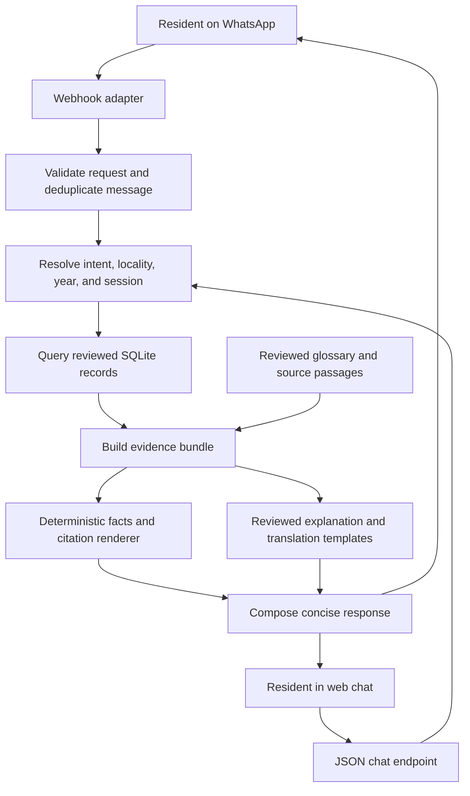

# Architecture

The implemented POC uses FastAPI, SQLite, plain browser JavaScript, and a Twilio WhatsApp Sandbox adapter. Both channels share reviewed project lookup, English/Kiswahili explanations, and bounded claim verification. Expanded manual live WhatsApp checks passed on September 20, 2026. No runtime AI service or audio feature is enabled; see the [implementation plan](implementation-plan.md) for scope and delivery status.

## Components and flow



Maintain one deployable backend and one database for the pilot. Source ingestion is a separate, operator-run preparation step with human review before records become searchable. The fixed POC uses no vector database or external retrieval service.

## Frontend: same repository and deployment

Use a small `frontend/` directory containing HTML, CSS, and browser JavaScript. FastAPI serves the page and its static assets alongside the API; serving static assets is supported in the [official FastAPI documentation](https://fastapi.tiangolo.com/tutorial/static-files/). This POC needs no separate frontend server, package build, client-side router, or frontend deployment.

The browser sends messages to a same-origin JSON endpoint using `fetch`. The endpoint and WhatsApp adapter call the same conversation service. Return structured project cards, citations, clarification choices, and explanatory text; the browser only presents them. Verification and factual decisions stay on the backend. Render text safely rather than inserting generated HTML, and allow only validated HTTPS source links on `.go.ke` hosts.

Start with one request and response per message, a visible loading state, and an explicit retry action. Streaming and WebSockets are deferred. See the [frontend design](frontend-design.md) for the screen layout.

## Responsibilities

| Component | Responsibility |
| --- | --- |
| WhatsApp adapter | Validate provider requests, normalize inputs, send replies, handle retries |
| Web chat adapter | Accept bounded JSON messages and return structured conversation results |
| Browser UI | Display the conversation, project cards, language control, and source links |
| Conversation service | Track short-lived language preference, locality, year, and numbered result selections |
| Locality resolver | Match the three covered ward names; clarify ambiguous or uncovered locations |
| Project service | Retrieve reviewed project facts using parameterized queries |
| Evidence builder | Collect matching observations, source metadata, excerpts, and coverage boundaries |
| Verification service | Compare supported claim fields against comparable observations |
| Renderer | Format exact factual fields, readable citations, and status wording |
| Explanation service | Render reviewed glossary definitions and selected-project explanations using fixed English/Kiswahili wording |

## Factual output boundary

Amounts, project names, financial years, and source references come from database fields and are rendered in code. They are not accepted as authoritative values from generated prose.

`explainer.py` supplies fixed glossary definitions and selected-record explanations; `translator.py` supplies fixed conversational wording. Approved wording is recorded in [language-review.md](language-review.md). No generative provider or vector store is used. Project facts and citations are preserved when changing language.

Milestone 3 uses `verification.py` to parse a full, bounded claim and compare exact decimal amounts after resolving project identity, ward, financial year, stage, and amount type. No claim scope is inherited from previous discovery. Only a directly comparable conflicting amount produces a contradiction; unmatched or conflicting sources yield insufficient evidence. Allocation plus an unsupported spending/completion clause yields partial support only when the allocation matches. The renderer shows every compared observation and citation.

Treat retrieved text and user claims as data. Instructions embedded in a PDF or a WhatsApp message cannot override the application’s evidence rules.

## Application interfaces

| Interface | Purpose |
| --- | --- |
| `GET /` | Serve the web chat page |
| `POST /api/v1/chat` | Accept a message or selected action with language and temporary session context |
| `GET /api/v1/coverage` | Supply current records, source inventory, and implemented feature flags to the frontend |
| `POST /api/v1/whatsapp/webhook` | Receive provider messages |
| `GET /api/v1/projects` | Search by normalized locality and financial year |
| `GET /api/v1/projects/{id}` | Return project observations with citations |
| `POST /api/v1/chat` with `action: explain` or an explanation question | Explain a reviewed term or selected record; no separate explanation endpoint is needed |
| `POST /api/v1/chat` with a `Verify` / `Hakiki` question | Parse a bounded claim and compare its scope and amount with reviewed observations |
| `GET /health` | Report basic application health without sensitive details |

The chat, coverage, project, health, and WhatsApp routes are implemented; verification runs through the same chat route. Chat actions include `language` and `explain`; the response includes its active language, separate glossary references, and verification metadata when checking a claim. Omitted language retains the session preference. The web page, static assets, chat endpoint, and WhatsApp webhook need external access for a hosted demo. Other development interfaces can remain local. Keep provider credentials exclusively on the backend.

## Operational behavior

- Deduplicate provider message IDs so retries do not trigger repeated work or replies.
- Validate webhook signatures before processing externally received requests.
- Return deterministic, cited TwiML replies without external AI calls.
- Store secrets in environment variables; redact phone numbers, message bodies, and credentials from routine logs.
- Restrict source fetching to operator-reviewed URLs; do not fetch arbitrary links from incoming messages.
- Apply request-size and rate limits before exposing the prototype.

## Repository layout

The implemented layout is:

```text
track-a-mtaani/
├── README.md
├── requirements.txt
├── .env.example
├── frontend/           # HTML, CSS, app.js, translations.js
├── docs/               # Setup references, design, review evidence, submission copy
├── data/
│   ├── raw/            # Two official budget snapshots used by checksum validation
│   ├── processed/     # Reviewed records and the approved M4 review batch
│   └── seeds/         # Reviewed demo_projects.json
├── src/
│   ├── main.py        # Web page and JSON routes
│   ├── api/whatsapp.py
│   ├── services/      # intent, locality, projects, citations, explainer,
│   │                  # translator, verification
│   ├── models/        # project and evidence contracts
│   └── db/            # database and reviewed-seed import
├── tests/             # Intent, locality, projects, citations, language,
│                      # verification and WhatsApp checks
└── output/            # PDF pitch deck and labeled browser rehearsal
```

Conversation routing lives in `services/intent.py`, reviewed record lookup in `services/projects.py`, and bounded claim comparison in `services/verification.py`. The glossary is implemented in `explainer.py`; no separate `retrieval.py` is needed. The proposed `speech.py` remains outside this submission and has not been created.

`data/seeds/demo_projects.json` contains the same reviewed facts as `data/processed/projects.json`. Synthetic conflict fixtures remain in tests. Retain the source PDFs: startup validates their hashes, and they support offline source inspection. The M4 candidate file records the approved five-record review batch.

The repository is private with no open-source license; no `LICENSE` file is included. Local `.env`, SQLite databases, caches, and `tmp/` are excluded from Git. `requirements.txt` and `.env.example` describe the implemented dependencies and configuration.

## Implemented WhatsApp boundary

`src/api/whatsapp.py` validates all received form fields using Twilio's SDK and the exact configured public URL. It calls the existing conversation service and formats the same evidence as concise TwiML text. Sources shared by several results are listed once with per-project source/page references. There are no outbound REST calls.

The adapter is disabled unless explicitly enabled and configured. It requires an account supporting custom TwiML replies; current trial restrictions must be checked on the actual account. See [Twilio signature validation](https://www.twilio.com/docs/usage/security) and [trial limitations](https://www.twilio.com/docs/usage/trials/try-out-whatsapp).

SQLite retains only message IDs and expiration timestamps for duplicate detection, for 24 hours. Sender-to-conversation mappings use keyed hashes and remain in memory for 30 minutes of inactivity. Use one worker; multi-worker session coordination is outside this POC. Deduplication prevents repeated processing within its window, but an HTTP response lost before Twilio consumes it can lose a reply; this is not an exactly-once delivery guarantee.
