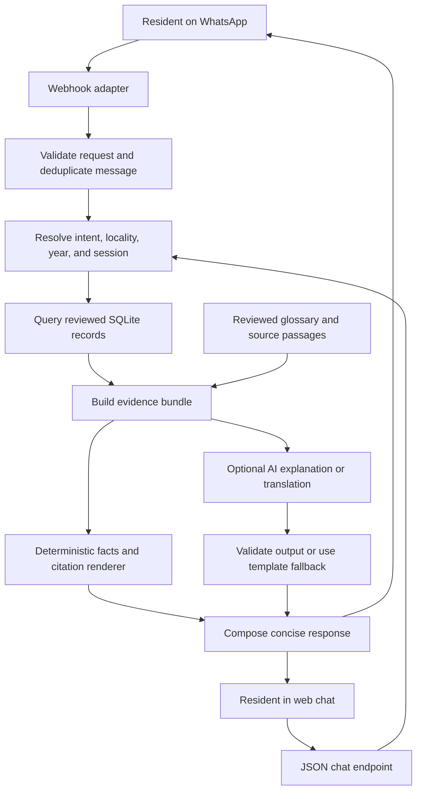

# Proposed architecture

The first browser slice is implemented, and the WhatsApp adapter is locally tested with live configuration pending. Later explanation/translation/verification components below remain design targets. The starting stack follows the supplied specification: Python with FastAPI, SQLite, and a Twilio WhatsApp Sandbox adapter. Provider setup and current API requirements must be checked against official documentation when implementation begins.

## Components and flow



Maintain one deployable backend and one database for the pilot. Source ingestion is a separate, operator-run preparation step with human review before records become searchable. A vector database is unnecessary for the first slice; add text search only when a concrete explanation use case needs it.

## Frontend: same repository and deployment

Use a small `frontend/` directory containing HTML, CSS, and browser JavaScript. FastAPI serves the page and its static assets alongside the API; serving static assets is supported in the [official FastAPI documentation](https://fastapi.tiangolo.com/tutorial/static-files/). This POC needs no separate frontend server, package build, client-side router, or frontend deployment.

The browser sends messages to a same-origin JSON endpoint using `fetch`. The endpoint and WhatsApp adapter call the same conversation service. Return structured project cards, citations, clarification choices, and explanatory text; the browser only presents them. Verification and factual decisions stay on the backend. Render text safely rather than inserting generated HTML, and allow only validated HTTP(S) source links.

Start with one request and response per message, a visible loading state, and an explicit retry action. Streaming and WebSockets are deferred. See the [frontend design](frontend-design.md) for the screen layout.

## Responsibilities

| Component | Responsibility |
| --- | --- |
| WhatsApp adapter | Validate provider requests, normalize inputs, send replies, handle retries |
| Web chat adapter | Accept bounded JSON messages and return structured conversation results |
| Browser UI | Display the conversation, project cards, language control, and source links |
| Conversation service | Track short-lived language preference, locality, year, and numbered result selections |
| Locality resolver | Match reviewed aliases; return candidates when ambiguous |
| Project service | Retrieve reviewed project facts using parameterized queries |
| Evidence builder | Collect matching observations, source metadata, excerpts, and coverage boundaries |
| Verification service | Compare supported claim fields against comparable observations |
| Renderer | Format exact factual fields, readable citations, and status wording |
| Explanation adapter | Produce bounded explanatory text; enforce timeouts and fallback behavior |

## Factual output boundary

Amounts, project names, financial years, and source references come from database fields and are rendered in code. They are not accepted as authoritative values from generated prose.

Milestone 2 uses `explainer.py` for fixed glossary lookup and selected-record explanations, and `translator.py` for fixed conversational wording. The owner approved the wording in `docs/language-review.md`. No generative provider or vector store is required. The explanation layer receives only the necessary evidence and a constrained output contract. Start with reviewed templates and glossary wording. Any generated text that introduces unsupported figures, citations, or project-status claims must be rejected. Numeric checks alone cannot establish semantic correctness; keep the permitted output narrow and exercise the behavior through adversarial examples before enabling it.

Milestone 3 uses `verification.py` to parse a full, bounded claim and compare exact decimal amounts after resolving project identity, ward, financial year, stage, and amount type. No claim scope is inherited from previous discovery. Only a directly comparable conflicting amount produces a contradiction; unmatched or conflicting sources yield insufficient evidence. Allocation plus an unsupported spending/completion clause yields partial support only when the allocation matches. The renderer shows every compared observation and citation.

Treat retrieved text and user claims as data. Instructions embedded in a PDF or a WhatsApp message cannot override the application’s evidence rules.

## Proposed application interfaces

| Interface | Purpose |
| --- | --- |
| `GET /` | Serve the web chat page |
| `POST /api/v1/chat` | Accept a message or selected action with language and temporary session context |
| `GET /api/v1/coverage` | Supply current records, source inventory, and implemented feature flags to the frontend |
| `POST /api/v1/whatsapp/webhook` | Receive provider messages |
| `GET /api/v1/projects` | Search by normalized locality and financial year |
| `GET /api/v1/projects/{id}` | Return project observations with citations |
| `POST /api/v1/chat` with `action: explain` or an explanation question | Explain a reviewed term or selected record; no separate explanation endpoint is needed |
| `POST /api/v1/chat` with a `Verify` / `Hakiki` question | Parse a bounded claim and compare its scope and amount with reviewed observations |
| `GET /health` | Report basic application health without sensitive details |

The chat, coverage, project, health, and WhatsApp routes are implemented; verification runs through the same chat route. Chat actions include `language` and `explain`; the response includes its active language, separate glossary references, and verification metadata when checking a claim. Omitted language retains the session preference. The web page, static assets, chat endpoint, and WhatsApp webhook need external access for a hosted demo. Other development interfaces can remain local. Keep provider credentials exclusively on the backend.

## Operational behavior

- Deduplicate provider message IDs so retries do not trigger repeated work or replies.
- Validate webhook signatures before processing externally received requests.
- Use short timeouts for AI requests and return a cited template response on failure.
- Begin with deterministic webhook replies. Before adding slow provider calls, verify the messaging provider's response limits and select a supported asynchronous reply flow if needed.
- Store secrets in environment variables; redact phone numbers, message bodies, and credentials from routine logs.
- Restrict source fetching to operator-reviewed URLs; do not fetch arbitrary links from incoming messages.
- Apply request-size and rate limits before exposing the prototype.

## Repository layout

Use the owner's supplied structure below, retaining the already agreed `frontend/` and the two existing planning documents. This is the target layout, not an inventory of files already implemented. The frontend, initial backend modules, reviewed data, and their tests now exist; later modules are created only when needed.

```text
track-a-mtaani/
├── README.md
├── LICENSE
├── requirements.txt
├── .env.example
├── frontend/
│   ├── index.html
│   ├── styles.css
│   └── app.js
├── docs/
│   ├── architecture.md
│   ├── product-requirements.md
│   ├── data-sources.md
│   ├── privacy.md
│   ├── trust-model.md
│   ├── limitations.md
│   ├── frontend-design.md
│   └── implementation-plan.md
├── data/
│   ├── raw/
│   │   └── county-budget.pdf
│   ├── processed/
│   │   └── projects.json
│   └── seeds/
│       └── demo_projects.json
├── src/
│   ├── main.py
│   ├── api/
│   │   └── whatsapp.py
│   ├── services/
│   │   ├── intent.py
│   │   ├── locality.py
│   │   ├── projects.py
│   │   ├── retrieval.py
│   │   ├── explainer.py
│   │   ├── translator.py
│   │   ├── citations.py
│   │   └── speech.py
│   ├── models/
│   │   ├── project.py
│   │   └── evidence.py
│   └── db/
│       ├── database.py
│       └── seed.py
└── tests/
    ├── test_intent.py
    ├── test_locality.py
    ├── test_projects.py
    ├── test_citations.py
    ├── test_verification.py
    └── test_whatsapp.py
```

Keep the web page route and small JSON routes in `src/main.py` initially. Share conversation routing through `services/intent.py`, use `services/projects.py` for evidence lookup and bounded claim comparison, and `models/evidence.py` for evidence contracts. These responsibilities do not require additional service packages for the POC.

`retrieval.py` supports the already scoped glossary/source passage lookup; it does not require vector infrastructure. `speech.py` is reserved from the supplied layout and must remain unimplemented for this submission. Create files as their milestone requires them rather than adding empty modules or placeholder tests.

Use `data/seeds/demo_projects.json` for the reviewed demo seed, derived from `data/processed/projects.json`. Keep synthetic test fixtures inside tests and clearly label any temporary frontend design fixtures. Do not create a fake budget PDF or populate official-looking sample records. The filename `county-budget.pdf` represents a real source to collect; additional official documents belong in the same raw directory.

The owner selects the license before `LICENSE` is finalized. Populate `requirements.txt` and `.env.example` with the dependencies and credential names actually used when scaffolding begins. The [implementation plan](implementation-plan.md) governs completion and scope.

## Implemented WhatsApp boundary

`src/api/whatsapp.py` validates all received form fields using Twilio's SDK and the exact configured public URL. It calls the existing conversation service and formats the same evidence as concise TwiML text. Sources shared by several results are listed once with per-project source/page references. There are no outbound REST calls.

The adapter is disabled unless explicitly enabled and configured. It requires an account supporting custom TwiML replies; current trial restrictions must be checked on the actual account. See [Twilio signature validation](https://www.twilio.com/docs/usage/security) and [trial limitations](https://www.twilio.com/docs/usage/trials/try-out-whatsapp).

SQLite retains only message IDs and expiration timestamps for duplicate detection, for 24 hours. Sender-to-conversation mappings use keyed hashes and remain in memory for 30 minutes of inactivity. Use one worker; multi-worker session coordination is outside this POC. Deduplication prevents repeated processing within its window, but an HTTP response lost before Twilio consumes it can lose a reply; this is not an exactly-once delivery guarantee.
